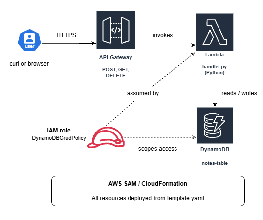
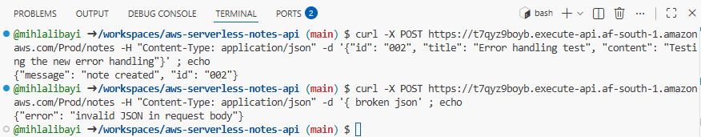
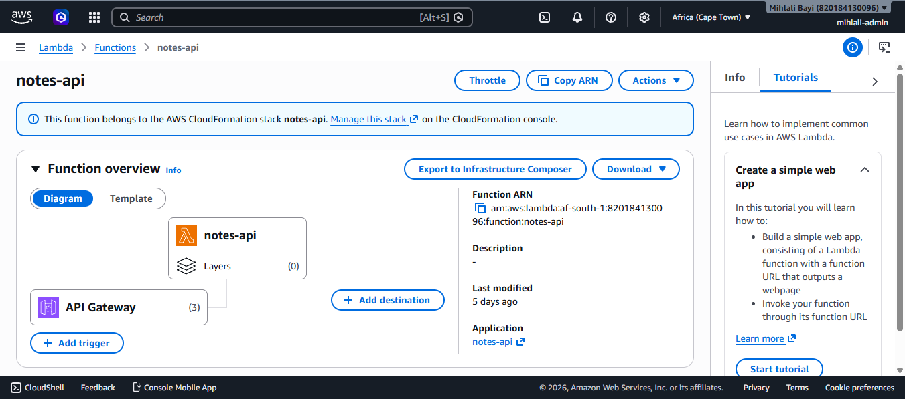
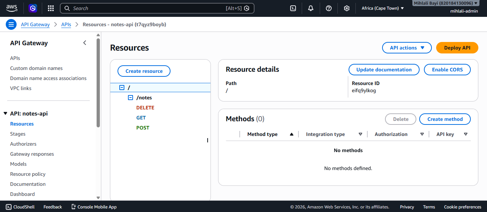
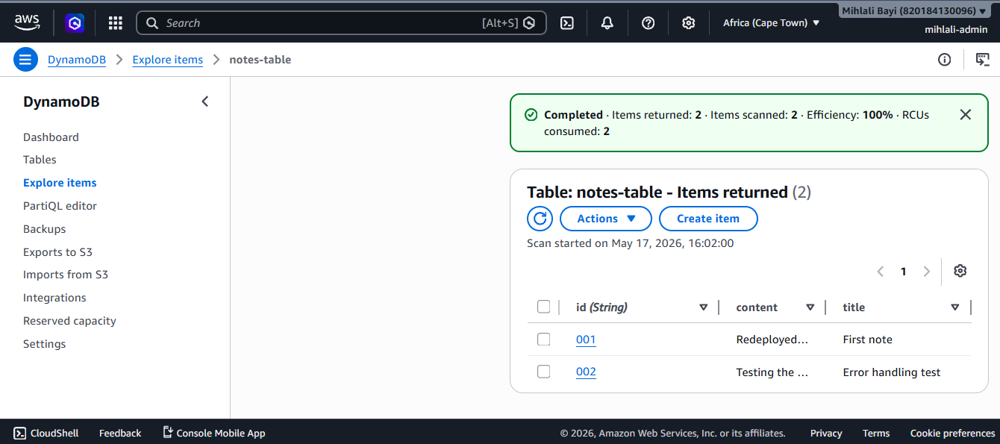
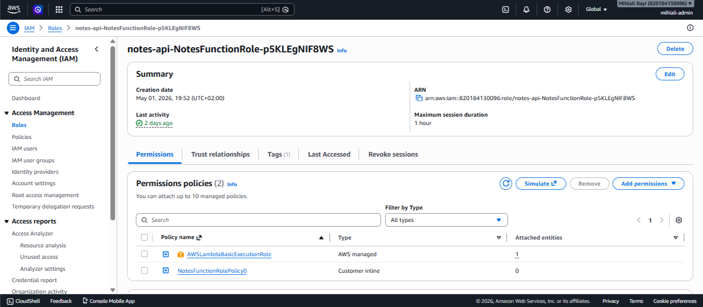

# Serverless Notes API

I built this to understand how serverless backends work in practice. Most tutorials explain Lambda in isolation so I wanted to see how it connects to a real database and sits behind a real API that you can actually call.

## Architecture



A client sends an HTTPS request to API Gateway. API Gateway routes the request to a Lambda function based on the HTTP method. Lambda runs the Python handler, talks to DynamoDB, and returns a response. An IAM role gives the Lambda scoped permissions to the table, nothing more. The entire stack is defined in a SAM template and deployed with one command.

## What it does

A REST API that lets you create, fetch, and delete notes. No servers to manage because Lambda runs the code on demand, API Gateway handles the routing, and DynamoDB stores the data.

## How it works

POST /notes creates a new note, GET /notes?id=001 fetches a specific note, GET /notes fetches all notes, and DELETE /notes?id=001 deletes a note.

A request comes in through API Gateway, which triggers the Lambda function. The function checks the HTTP method, runs the right logic, talks to DynamoDB, and sends back a response. No server is running between requests and Lambda only executes when something calls it.

## Stack

- **Compute:** AWS Lambda (Python 3.11) running on demand
- **API:** Amazon API Gateway exposing REST endpoints
- **Database:** Amazon DynamoDB (Single-AZ, PAY_PER_REQUEST billing)
- **Infrastructure as Code:** AWS SAM deploys the entire stack from one template
- **Region:** Africa (Cape Town), `af-south-1`

## Project structure

The Lambda logic lives in `src/handler.py`. Tests are in `tests/test_handler.py` and cover every route plus error paths. The whole AWS infrastructure (Lambda, API Gateway, DynamoDB table, IAM role) is defined in `template.yaml` and deploys with one `sam deploy` command. Screenshots of the deployed setup are in `screenshots/`.

## Error handling

The handler wraps every external call in try/except so failures return clean HTTP errors instead of crashing the Lambda.

- Missing request body returns 400 with a clear message
- Malformed JSON returns 400 instead of a 502 crash
- DynamoDB failures (throttling, network issues, permission errors) return 500 and the underlying exception gets logged to CloudWatch for debugging
- Missing required fields returns 400 listing what was expected
- Unsupported HTTP methods return 405

The principle is that the user should always get a useful error code and message they can act on, not a black-box 502.



Top half shows a successful POST returning 201. Bottom half shows a malformed JSON body being caught and returned as a 400 with a clear message.

## Testing

Tests use mocking so they run locally without needing a real AWS connection. Every route is covered including edge cases like missing fields, missing body, malformed JSON, notes that don't exist, and DynamoDB failures. The DynamoDB failure tests use `side_effect=Exception` to simulate the mock raising an error, which exercises the try/except paths.

To run them:

```
pytest tests/ -v
```

## Testing the live API

These commands test the live API from any terminal. Replace the URL with your own API Gateway endpoint.

Create a note:

```
curl -X POST https://t7qyz9boyb.execute-api.af-south-1.amazonaws.com/Prod/notes \
  -H "Content-Type: application/json" \
  -d '{"id": "001", "title": "First note", "content": "My API is live!"}'
```

Fetch a specific note:

```
curl https://t7qyz9boyb.execute-api.af-south-1.amazonaws.com/Prod/notes?id=001
```

Fetch all notes:

```
curl https://t7qyz9boyb.execute-api.af-south-1.amazonaws.com/Prod/notes
```

Delete a note:

```
curl -X DELETE https://t7qyz9boyb.execute-api.af-south-1.amazonaws.com/Prod/notes?id=001
```

## What I learned

IAM permissions were the thing that took the longest to understand. AWS denies everything by default so Lambda needs explicit permission to touch DynamoDB, and getting that wrong gives you a cryptic AccessDeniedException with no obvious fix if you don't know what you're looking for. Using a SAM-managed policy like `DynamoDBCrudPolicy` scoped to a specific table is the clean way to follow least-privilege.

The other thing that clicked was why the response has to be shaped a specific way. API Gateway is strict about statusCode, headers, and a body that is a string not a dictionary. Miss any of those and it breaks silently in a way that looks like a Lambda problem but isn't. The response helper function in my handler exists specifically to make sure every return has the right shape.

Going back to add error handling taught me that "the happy path works" is not the same as "the code is robust." Without try/except blocks around external calls, any DynamoDB issue would crash the Lambda and return a confusing 502. With them, every failure becomes a meaningful error response the client can act on.

I also learned the hard way that mixing manual console clicks with Infrastructure-as-Code is messy. My DynamoDB table was originally created in the AWS console, which meant my SAM template couldn't create or manage it. I fixed this later by deleting the orphan table and adding the table resource back to the SAM template, so the entire stack now deploys from one source of truth.

## The setup in screenshots

Lambda function deployed via SAM with API Gateway trigger:


API Gateway routes wired to the Lambda function:


DynamoDB table with live data:


IAM execution role with DynamoDB access policy attached:


## API in action

Creating a note and fetching it back from a live DynamoDB table:


## What I would improve

- Add update functionality with a PUT route
- Add authentication so only the note owner can delete their notes
- Use a proper UUID generator for note IDs instead of accepting client-supplied ones
- Add pagination to the scan operation so it handles large numbers of notes
- Replace `print()` statements with the Python `logging` module for structured log levels (INFO, WARNING, ERROR)
- Catch specific exceptions like `botocore.exceptions.ClientError` instead of broad `Exception`, and handle different AWS error types differently (retry on throttling, fail fast on permission denied)
- Add CORS headers so a browser-based frontend could call this API
- Add CloudWatch alarms on Lambda errors and DynamoDB throttling
- Split the deployment into dev and prod stages instead of just Prod

## Cost

Runs entirely within the AWS Free Tier. Lambda, API Gateway, and DynamoDB all have generous free limits that this project doesn't get close to. Total monthly cost: $0.