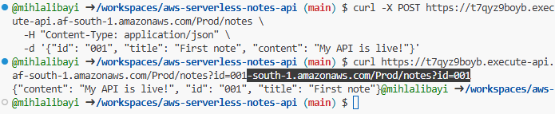

# Serverless Notes API

I built this to understand how serverless backends work in practice.
Most tutorials explain Lambda in isolation so I wanted to see how it
connects to a real database and sits behind a real API that you can
actually call.

## What it does

A REST API that lets you create, fetch, and delete notes. No servers
to manage because Lambda runs the code, API Gateway handles the routing,
and DynamoDB stores the data.

## How it works

POST /notes creates a new note, GET /notes?id=001 fetches a specific
note, GET /notes fetches all notes, and DELETE /notes?id=001 deletes
a note.

A request comes in through API Gateway, which triggers the Lambda
function. The function checks the HTTP method, runs the right logic,
talks to DynamoDB, and sends back a response. No server is running
between requests and Lambda only executes when something calls it.

## Services used

AWS Lambda runs the Python code on demand. API Gateway gives the
Lambda a public URL and handles routing. DynamoDB stores the notes.
AWS SAM deploys all of the above from a single config file.

## Project structure

#### src/handler.py 
contains all the Lambda logic. 
#### tests/test_handler.py
covers every route and edge case. 
#### template.yaml 
is the SAM template that deploys everything to AWS.

## What I learned

IAM permissions were the thing that took the longest to understand.
AWS denies everything by default so Lambda needs explicit permission
to touch DynamoDB, and getting that wrong gives you a cryptic
AccessDeniedException with no obvious fix if you don't know what
you're looking for.

The other thing that clicked was why the response has to be shaped
a specific way. API Gateway is strict about statusCode, headers, and
a body that is a string not a dictionary. Miss any of those and it
breaks silently in a way that looks like a Lambda problem but isn't.

## What I would improve

Adding input validation so notes require a minimum title length,
update functionality with a PUT route, authentication so only the
note owner can delete their notes, a proper UUID generator for note
IDs instead of manual ones, and pagination on the scan to handle
large numbers of notes.

## Testing the API

These commands test the live API from any terminal. Replace the URL
with your own API Gateway endpoint.

### Create a note:
curl -X POST https://t7qyz9boyb.execute-api.af-south-1.amazonaws.com/Prod/notes \
  -H "Content-Type: application/json" \
  -d '{"id": "001", "title": "First note", "content": "My API is live!"}'

### Fetch a specific note:
curl https://t7qyz9boyb.execute-api.af-south-1.amazonaws.com/Prod/notes?id=001

### Fetch all notes:
curl https://t7qyz9boyb.execute-api.af-south-1.amazonaws.com/Prod/notes

### Delete a note:
curl -X DELETE https://t7qyz9boyb.execute-api.af-south-1.amazonaws.com/Prod/notes?id=001

## Running the tests

Tests use mocking so they run locally without needing a real AWS
connection. Every route is covered including edge cases like missing
fields and notes that don't exist.

## Cost

Runs entirely within the AWS Free Tier. Lambda, API Gateway, and
DynamoDB all have generous free limits that this project doesn't
get close to.

## API in action

Creating a note and fetching it back from a live DynamoDB table:

